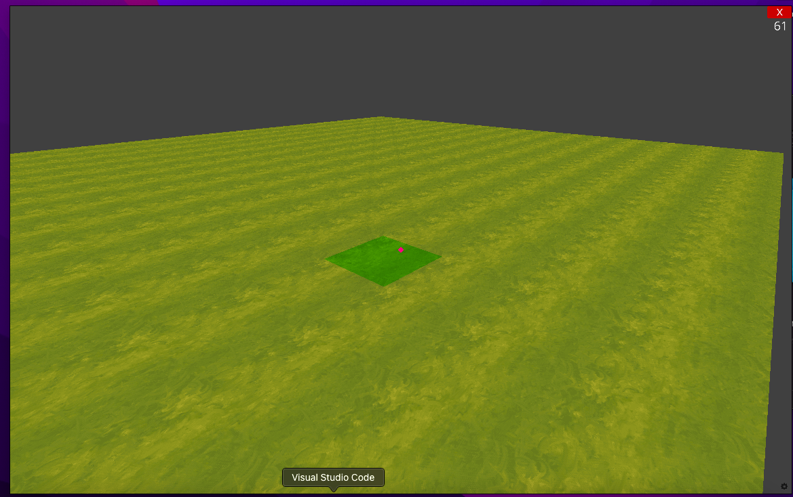
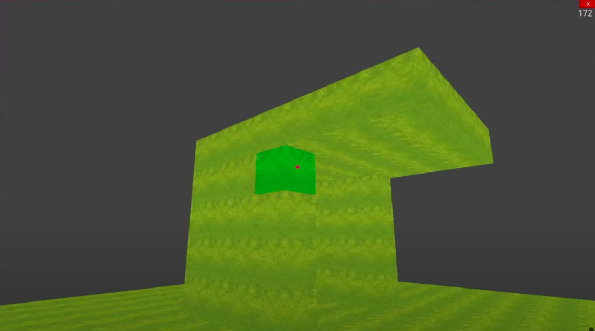

# base de Juego tipo Minicraf

## crear un entorno virtual para Python
```bash 
virtualenv env 
```
## instalar la libreria ursina 
https://www.ursinaengine.org/ 
```bash
python3 -m pip install ursina
```
### correr el programa
```bash
python3 minicraf.py
```
## demo minimo



